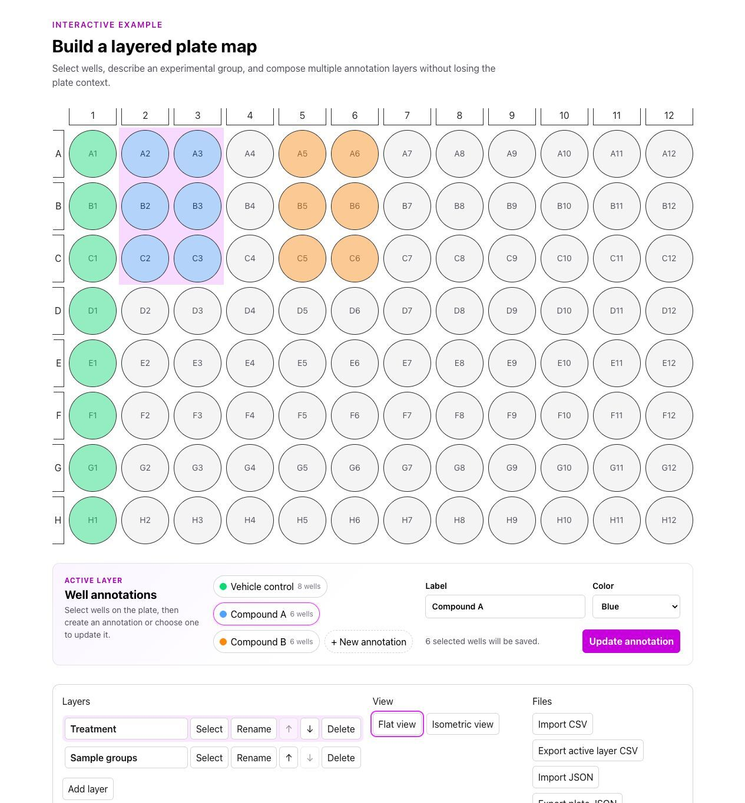
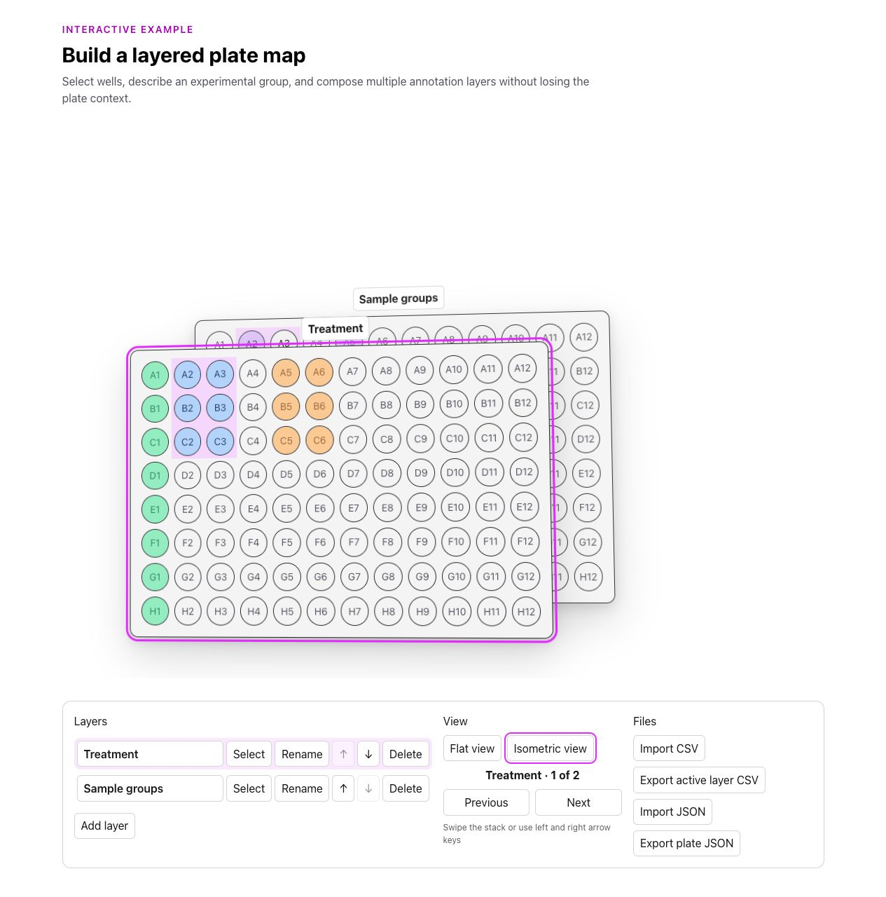

# Nitro Platemap

Accessible React components for building interactive laboratory plate maps. Nitro Platemap supports standard plate sizes from 24 to 1,536 wells, composable well annotations, editable layers, keyboard-friendly selection, CSV/JSON workflows, and customizable styling.

Built for [Nitro Bio's BioGraphics](https://biographics.nitro.bio/) and [PlatePlanner](https://plateplanner.nitro.bio/), and available as a standalone React package.



## Features

- Model a plate as an ordered stack of independently editable layers
- Select individual wells, rows, columns, or drag across a range
- Create annotations from the current selection and update existing annotations
- Switch between an editable flat view and a read-only isometric stack
- Add, rename, reorder, and delete layers with accessible controls
- Import and export tidy CSV data or a versioned JSON document
- Customize the interface with semantic `--platemap-*` CSS variables
- Render plates up to 1,536 wells and respect reduced-motion preferences

## Install

```sh
pnpm add @nitro-bio/platemap
```

The package requires React and React DOM 18.2 or newer.

## Quick start

```tsx
import {
  Plate,
  PlateControls,
  usePlateReducer,
} from "@nitro-bio/platemap";
import "@nitro-bio/platemap/dist/nitro-platemap.css";

export function PlateEditor() {
  const reducer = usePlateReducer({ initialPlateSize: 96 });

  return (
    <>
      <Plate {...reducer} />
      <PlateControls {...reducer} />
    </>
  );
}
```

`usePlateReducer` is the canonical state engine shared by `Plate` and `PlateControls`. Layers are stored in visual top-to-bottom order and the layer collection is always non-empty. Selection and excluded wells remain global across layers.

## Create and update well annotations

The demo includes a complete [well annotation editor example](src/WellAnnotationEditor.tsx). Select wells on the plate, enter a label and semantic color, and create an annotation on the active layer. Choose an existing annotation to edit its label or color; saving with wells selected replaces its well set, while saving with no selection keeps its existing wells.

The editor composes the public reducer API: it reads `plateState.selection` and the active layer, then persists a new annotation array with `plateActions.setLayerAnnotations`. `plateActions.setActiveWellAnnotation` tracks which annotation the surrounding interface is editing.

## Layered views

Flat view renders and edits the active layer, including overlapping color-coded well annotations. Isometric view renders the complete annotated stack as a read-only overview with layer navigation.



`PlateControls` includes layer creation, activation, inline rename, accessible reordering, delete confirmation, view switching, and file import/export.

## Data formats

The durable JSON document uses `schemaVersion: 1` and contains `plateSize`, `excludedWells`, and `layers`. Transient interface state—including selection, active IDs, and view mode—is intentionally omitted. `parsePlateState` accepts this document format as well as validated legacy flat state; legacy IDs are regenerated during migration.

Tidy CSV imports require `Well` and `Annotation` columns. `Annotation Key` and `Color` are optional, and additional columns are preserved as flat primitive metadata. The older plate-shaped CSV matrix remains available for export, but is not accepted by the layer importer.

## Documentation

- [API documentation](https://docs.nitro.bio/Platemap)
- [Layer specification](docs/plate-map-layers-spec.md)
- [BioGraphics](https://biographics.nitro.bio/) — open-license scientific figure builder
- [PlatePlanner](https://plateplanner.nitro.bio/) — build and share beautiful plate maps

## License

[GPL-3.0-or-later](LICENSE)
